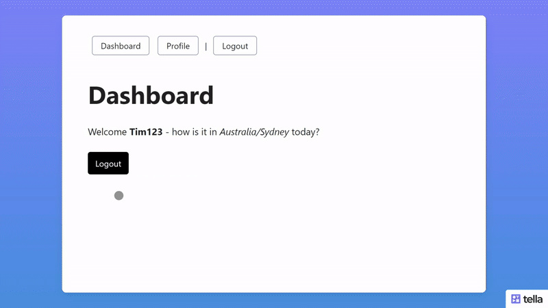

# Nuxt Dashboard Starter

> A minimal Nuxt 3 dashboard starter with everything you need for user authentication and protected dashboard pages.

- 🧑🏻 Uses MongoDB to store users & sessions
- 🧑🏻 Exposes a MongoDB connection you can use anywhere
- 🚪 Login & registration pages
- 🔐 Protected dashboard & profile pages
- 🔐 Route authentication middleware
- 🔐 Server side authentication
- ✅ Example API route
- 🚦 Rate limits
- 🎨 Simple CSS styling

## Setup

Clone the repo to your local:

```bash
git clone https://github.com/timb-103/nuxt-dashboard-starter.git
```

Make sure to install the dependencies:

```bash
npm install
```

## MongoDB

This project uses [Nuxt MongoDB Auth](https://github.com/timb-103/nuxt-mongodb-auth) for all database operations, so you'll need to create a free database via [mongodb.com](https://www.mongodb.com/) before starting.

Get the mongo connection string from your free db and add a `.env` to the root of the project with these values:

```env
MONGO_CONNECTION_STRING={your_connection_string}
MONGO_DB={your_db_name}
```

You can then use your mongo connection in your server routes:

```js
import { mongo } from '#nuxt-mongodb-auth'

const db = mongo.db()
const response = await db.collection('YOUR_COLLECTION').find()
```

## Server Side Authentication

Protect your api routes by adding our helper function to the top of your file:

```js
import { requiresAuthSession } from '#nuxt-mongodb-auth'

export default defineEventHandler(async (event) => {
  const user = await requiresAuthSession(event)
})
```

## Route Authentication Middleware

We provide 2 middlewares, one for protected pages and one for pages that should redirect to the dashboard if the user is logged in:

```js
definePageMeta({ middleware: 'auth' })
definePageMeta({ middleware: 'not-auth' })
```

If a session has expired, the user will be automatically logged out and redirected to the login page.

## User Composables

We have 4 composables for simple handling of user authentication:

```js
useAuthLogin(email, password)
useAuthRegister(email, password)
useAuthLogout()
useAuthUser()
```

## Rate Limits

We're using [Nuxt Rate Limit](https://github.com/timb-103/nuxt-rate-limit) for simple API rate limiting. You can add custom limits via the config in `nuxt.config.ts`.

We've added a default setting for the `/register` endpoint to prevent spam.

## Simple CSS Styling

We're using [Nuxt Simple CSS](https://github.com/timb-103/nuxt-simple-css) for simple styles. You can change colors via the `nuxtSimpleCss` config in `nuxt.config.ts`.

## Development & Building Server

```bash
npm run dev
npm run build
```

Check out the Nuxt [deployment documentation](https://nuxt.com/docs/getting-started/deployment) for more information.
